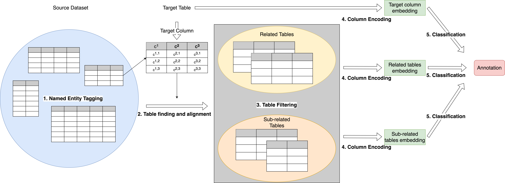

# RECA
This is the repository for the code and data of paper: RECA: Related Tables Enhanced Column Semantic Type Annotation Framework.

In order to reproduce the results on Semtab2019 dataset, please go through the following steps:
1. Download the pre-trained models and pre-processed data, please check the instructions in [checkpoints](https://github.com/RECA-paper/RECA/tree/main/Semtab/checkpoints) and [jsonl_data](https://github.com/RECA-paper/RECA/tree/main/Semtab/data/jsonl_data) for details. 
2. Tokenize the jsonl data, please follow the suggestions in [pre-process](https://github.com/RECA-paper/RECA/tree/main/Semtab/pre-process) (Alternatively, you can download the raw dataset from [here](http://www.cs.ox.ac.uk/isg/challenges/sem-tab/2019/#datasets) and pre-process the data from scratch. For detailed instructions please check [pre-process](https://github.com/RECA-paper/RECA/tree/main/Semtab/pre-process)).
3. Run the experiments, you can either load the pre-trained models and run [RECA-semtab-test-from-pre-trained.py](https://github.com/RECA-paper/RECA/blob/main/Semtab/experiment/RECA-semtab-test-from-pre-trained.py) or train from scratch by running [RECA-semtab-train+test.py](https://github.com/RECA-paper/RECA/blob/main/Semtab/experiment/RECA-semtab-train%2Btest.py)

In order to reproduce the results on WebTables dataset, please go through the following steps:
